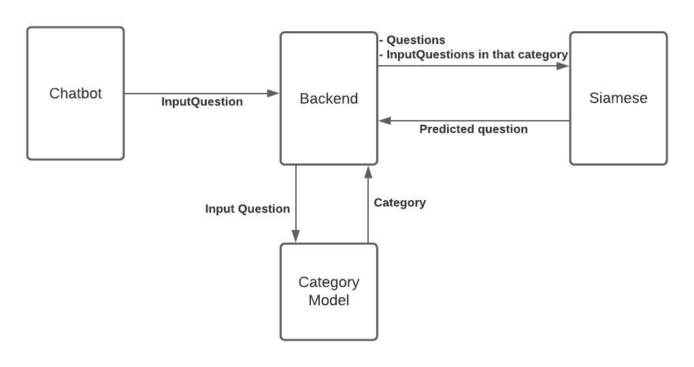
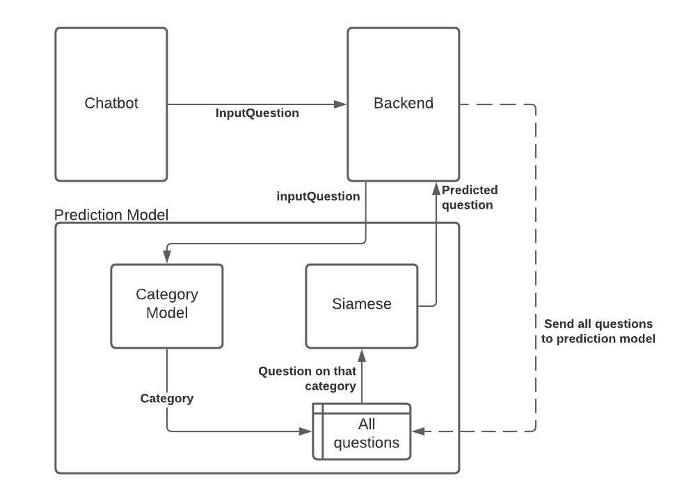
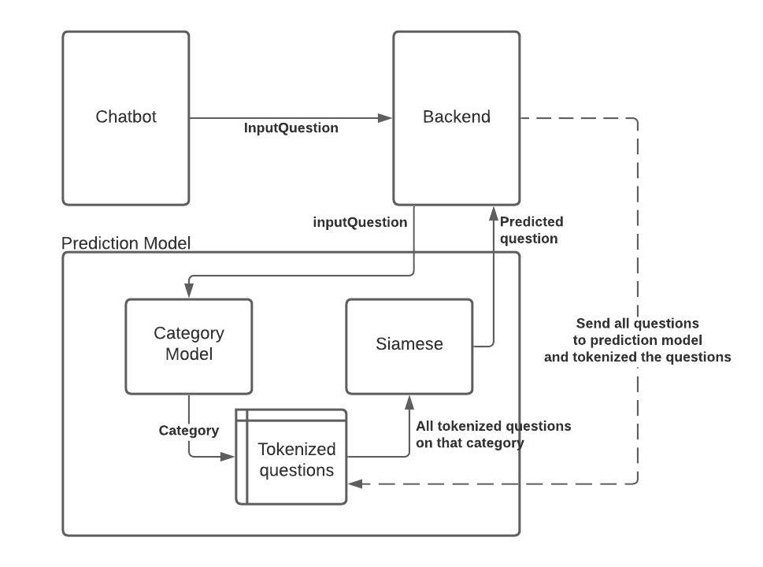

# Prediction Model of CPE KMUTT Chatbot

Prediction model API. It used to predict similarity of question.\
There are many patterns of prediction model.

This repository is part of the senior project group no. 59 in CPE KMUTT.

## Pattern 1

Separate between category model and Siamese model.

- Advantages:\
This pattern is good at separately model, better view of system, and low coupling.
- Disadvantages:\
Slow and bad performance

## Pattern 2

First combination version between category model and Siamese model.\
Keep all questions in the prediction model.

- Advantages:\
Faster than before.
- Disadvantages:\
High coupling and cannot automate update the questions.

## Pattern 3

Like pattern no.2 but tokenized the question immediately.

- Advantages:\
Faster and faster
- Disadvantages:\
High coupling and cannot automate update the questions.

## Pattern 4

Change Siamese model to Cosine Similarity.\

- Advantages:\
The fastest
- Disadvantages:\
The result could worse than Siamese model.
